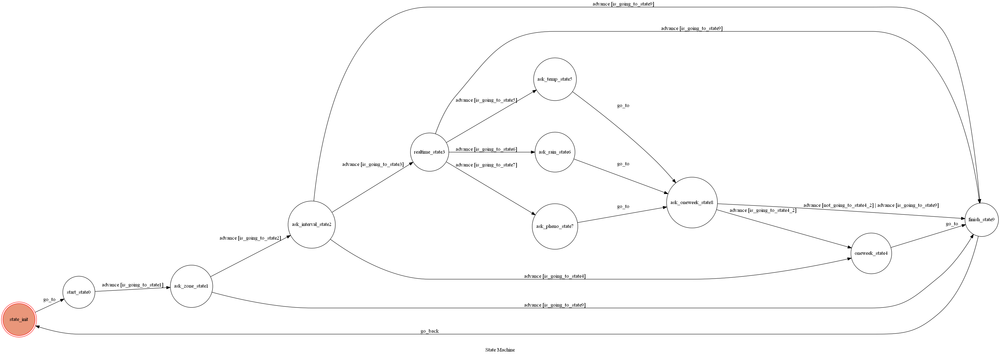

# TOC Project 2019 - Messenger Weather Chatbot

A Facebook messenger bot based on a finite state machine.

Use [OPEN WEATHER DATA](https://opendata.cwb.gov.tw/index)

## Setup

### Prerequisite
* Python 3.4
* Facebook Page and App
* HTTPS Server

#### Install Dependency
```sh
pip3 install -r requirements.txt
```

#### Secret Data

`FB_VERIFY_TOKEN`, `FB_ACCESS_TOKEN` and `WEATHER_KEY` **MUST** be set to environment variable.

#### Run 
1. Locally

    Using `ngrok` as a proxy.

    ```sh
    ./ngrok http 1029
    ```

    After that, `ngrok` would generate a https URL.

    Run the server

    ```sh
    python3 app.py
    ```
2. Heroku

    Deploy on Heroku

## Finite State Machine


#### Trigger
go_to : No condition go to next state

advance : Check condition and then go to next state 

go_back : No condition go back to initial state

#### Usage
1. The initial state is set to `state_init`.

2. Every time `state_init` state is triggered to `go_to` to `start_state0` and the bot will ask user to do something.

3. When user enter "天氣", the state wil change from `start_state0` to `ask_zone_state1` and the bot will ask user which zone in Tainan.

4. When user enter "xx區" which is real zone in Tainan, the state will change from `ask_zone_state1` to `ask_interval_state2` and the bot will ask user to type "現在" or "一週".

5. 
    1. When user enter "現在", the state will change from `ask_interval_state2` to `realtime_state3` and the bot will ask user to type "溫度", "降雨機率" or "天氣狀態".

    2. When user enter "一週", the state will change from `ask_interval_state2` to `oneweek_state4` and replies one week weather, then the state will triggered to `go_to` to `finish_state9` show "歡迎下次再來詢問天氣~" and `go_back` to `state_init`.

6. When user enter "溫度" "降雨機率" "天氣狀態", the state will change from `realtime_state3` to `ask_temp_state5` `ask_rain_state6` `ask_pheno_state7` separately and replies realtime temperature, then the state will triggrd to `go_to` to `ask_oneweek_state8` ask the user "你還想知道未來一周的天氣嗎?".

7. When user enter something is similar to yes such as "好", "想" and "yes", the state will change from `ask_oneweek_state8` to `oneweek_state4`; otherwise, when user enter something is similar to no such as "不好", "不想" and "no", the state will change from `ask_oneweek_state8` to `finish_state9`.

8. When the state is `ask_zone_state1` `ask_interval_state2` `realtime_state3` `ask_oneweek_state8`, the user can type "結束" to `go_to` state `finish_state9` and `go_back` to `state_init`.

#### Flow Chart
* state_init
	* go_to: start_state0
		* advance: ask_zone_state1
            * advance: ask_interval_state2
                * advance: realtime_state3
                    * advance: ask_temp_state5, ask_rain_state6, ask_pheno_state7
                        * go_to: ask_oneweek_state8
                            * advance: oneweek_state4
                                * advance: finish_state9
                                    * go_back: state_init
                            * advance: finish_state9
                                * go_back: state_init
                * advance: oneweek_state4
                    * advance: finish_state9
                        * go_back: state_init
                * advance: finish_state9
                    * go_back: state_init
            * advance: finish_state9
                * go_back: state_init